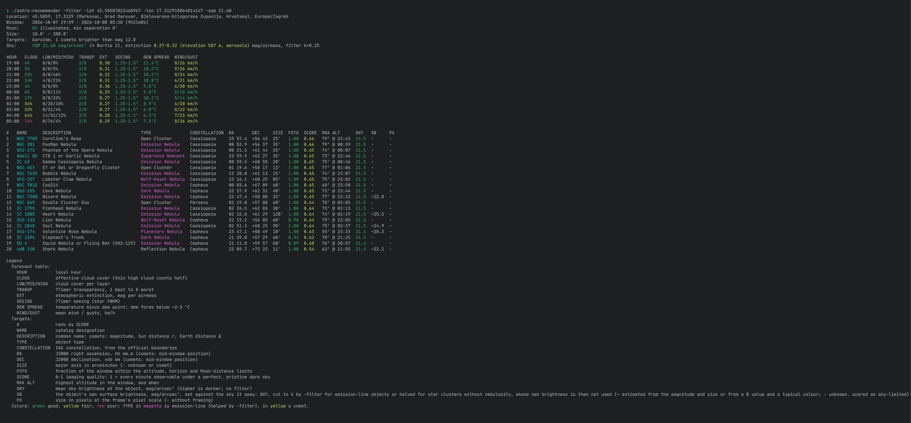

# astro-recommender

[](https://github.com/dkorunic/astro-recommender/releases/latest)
[](go.mod)
[](LICENSE)
[](https://github.com/dkorunic/astro-recommender/actions/workflows/pages.yml)
[](https://astrorecommender.org/)

A single-binary Go CLI that tells you what to image **tonight** from a given location. It ranks deep sky objects and bright comets over the whole astronomical night, from dusk to dawn (Sun below −18°), by how long each one stands high enough, far enough from the Moon and above your local horizon, and by how good the sky is while it does: the hourly cloud, transparency, dew and wind forecast, scattered moonlight, light pollution and atmospheric extinction all weigh in, minute by minute. The catalogues (about 30,000 objects in 14 lists) and the time-zone data are built in, no API keys are needed, and the astronomy is hand-rolled and checked against IAU SOFA. It also runs [in the browser](https://astrorecommender.org/), nothing to install.

It started as a port of the deep sky part of [uptonight](https://github.com/mawinkler/uptonight) and adds, among other things:

- **framing** for the **Celestron Origin** smart telescope (`-origin`) or any telescope and camera (`-fov`/`-scale`, or `-focal` with `-sensor`/`-pixel`): only objects that fit the frame and are large enough in pixels, scored by how well they fill it
- a sky-brightness model that weights every target by moonlight and light pollution, with optional narrowband `-filter` support that favours emission nebulae
- weather folded into the score, not just shown
- comets from the Minor Planet Center, a **night plan** (`-plan`) with one target per time block, a measured local horizon (`-horizon`) and many more catalogues



## Contents

- [Features](#features)
- [Install](#install)
- [In the browser](#in-the-browser)
- [Usage](#usage)
  - [Examples](#examples)
  - [Flags](#flags)
  - [Target lists](#target-lists)
  - [Comets](#comets)
  - [Night plan](#night-plan)
  - [Local horizon](#local-horizon)
- [How objects are ranked](#how-objects-are-ranked)
  - [Accuracy](#accuracy)
  - [Formulas and references](#formulas-and-references)
- [Privacy](#privacy)
- [Credits](#credits)

## Features

- **Tonight's window**: astronomical dusk to dawn (Sun below −18°; `-twilight nautical` uses −12° for bright targets and short summer nights), found by searching from the site's own solar noon so time zones and polar nights can't cut it short. A run during the night (after dusk, or after midnight) plans only the rest of it; `-date` plans another evening and `-from`/`-to` narrow the window. The header says when the Moon rises or sets within it.
- **Observability per minute**, following uptonight's rules: altitude between `-alt-min` and `-alt-max`, Moon separation of at least the illumination percentage in degrees (skipped while the Moon is below the horizon), and optionally above your measured **local horizon** profile (`-horizon`). Each object's longest unbroken observable stretch is listed, and `-min-run 1h` drops those without one that long.
- **Ranking** by an imaging score that sums, over every observable minute, the forecast sky quality × atmospheric extinction × a sky weight that sets the object's own surface brightness against the sky's, so a bright-surface object shrugs off moonlight and light pollution that a faint smudge does not, with uptonight's observable fraction (FOTO) shown alongside. Mean altitude breaks ties.
- **Sky brightness and moonlight**: the Krisciunas & Schaefer model of the moonless sky from `-bortle` or a measured `-sqm` value, brightened towards the horizon, plus scattered moonlight from the Moon's phase, altitude and distance to the target. Targets are weighted by sky-limited signal-to-noise.
- **Target-type sensitivity to sky glow**: clusters count half of it, and with `-filter` emission-line targets (emission and planetary nebulae, supernova remnants, Wolf-Rayet nebulae, plus known mislabelled ones) count only `-filter-k` of it, which also relaxes their Moon-distance limit.
- **Extinction per hour** from the site's elevation and the CAMS aerosol forecast (dust, smoke, haze), or a fixed `-extinction`; shown in the forecast table.
- **Weather**: Open-Meteo cloud cover by layer (thin high cloud counts half), rain, dew-point spread and wind gusts, and 7Timer transparency and seeing (with a seeing estimate from the ECMWF upper-air profile for hours 7Timer does not cover), in an hourly table and folded into the score minute by minute. Hours a forecast does not cover get the covered hours' mean; a source missing entirely counts as perfect sky. Both warn, never silently.
- **Framing for the Celestron Origin** (`-origin`) or any telescope (`-fov`/`-scale`, or `-focal` with `-sensor`/`-pixel`): keeps only objects that fit the frame's short side and are at least `-min-px` across, scores how well they fill it, and shows their size in pixels.
- **Comets** from the Minor Planet Center's daily elements, cached locally: two-body positions every minute (elliptic, parabolic and hyperbolic orbits), kept when brighter than `-comet-mag`, ranked like any other target.
- **Night plan** (`-plan 2h`): one target per time block, chosen by a greedy pass followed by a local search that swaps and moves targets between blocks.
- **Fifteen built-in target lists** (about 30,000 objects: Gary Imm's selection and full Compendium, Messier, Herschel 400, Pensack 500, NGC, IC, LBN, LDN, Sharpless, MWSC, Melotte, Collinder and two planetary nebula databases) or your own uptonight-format YAML, with every object's constellation computed from the IAU boundaries; a `-skip` file leaves out the ones you have already imaged.
- **Location handling**: offline IANA time-zone lookup from the coordinates, reverse geocoding of the site name, coordinates rounded to about 1 km before any request, and a fully offline mode.
- **Terminal output**: aligned, colour-coded tables with a legend; honours `NO_COLOR`, `CLICOLOR_FORCE` and `TERM=dumb`. Text from the network or from target files is stripped of control characters so it cannot inject terminal escape sequences. `-json` prints the same report as one JSON document for scripts.
- **Verified astronomy**: the hand-rolled Sun, Moon, sidereal-time, precession and altitude formulas are checked against IAU SOFA in the test suite (see [Accuracy](#accuracy)); a single static binary with no API keys.

## Install

Download a prebuilt binary for Linux, macOS or Windows from the [Releases](https://github.com/dkorunic/astro-recommender/releases) page.

Or with Go:

```sh
go install github.com/dkorunic/astro-recommender@latest
```

On macOS or Linux, Homebrew users can install it from the tap:

```sh
brew tap dkorunic/tap
brew install astro-recommender
```

On macOS the tap also has it as a cask:

```sh
brew install --cask dkorunic/tap/astro-recommender
```

Or from a checkout, using [Task](https://taskfile.dev/):

```sh
task build   # formats, then builds a static, PGO-optimised binary (profile: default.pgo)
task pgo     # regenerates default.pgo from the offline scoring benchmark
task test
task lint    # golangci-lint
```

Plain `go build .` works too.

It needs Go 1.27+. The target catalogues are built into the binary.

## In the browser

The same program runs at **https://astrorecommender.org/**, compiled to WebAssembly, with every flag as a form field. Nothing to install: the ranking runs in your browser, and your coordinates go only to the same forecast, geocoding and comet services the command line calls (7Timer and DarkSkySites through a small Cloudflare Worker, since they do not allow browser requests; it caches the answers per rounded coordinate and holds the DarkSkySites key).

What works there:

- every flag, built from the program's own `-h`; fields left empty keep their defaults
- `-targets`, `-horizon` and `-skip` take an uploaded file
- "Use my location" asks the browser for your position, and the location's time zone shows in the empty `-tz` field
- the address bar carries the form after each run (files excepted), so the URL can be bookmarked or shared (the Copy link button copies it); opening such a link fills the form and runs it
- weather, transparency and seeing, aerosols, geocoding and comets, as on the command line
- the DarkSkySites sky-brightness lookup, without a key of your own (the page's key is shared; `-no-sqm` skips it)
- light or dark theme following the browser, with a Theme button to override it (remembered by the browser)

What does not:

- caching: the comet elements are downloaded on every run instead of being kept for a day

## Usage

```sh
astro-recommender -lat 45.815 -lon 15.982 -origin -filter -bortle 6 -n 5 -date 2026-10-07
```

```
Location: 45.8150, 15.9820 (Mjesni odbor Zrinjevac, Gradska četvrt Donji grad, Zagreb, Grad Zagreb, Hrvatska), Europe/Zagreb
Window:   2026-10-07 20:04 - 2026-10-08 05:25 (9h21m0s)
Moon:     8% illuminated, min separation 8°, sets 20:48
Size:     4.1' - 44.7'
Targets:  GaryImm, 1 comets brighter than mag 12.0
Frame:    1.32° x 0.75°, 1.23"/px (3856 x 2180 px)
Sky:      Bortle 6 (zenith 18.80 mag/arcsec²), extinction 0.29-0.33 (elevation 126 m, aerosols) mag/airmass, filter k=0.25

HOUR   CLOUD  LOW/MID/HIGH  TRANSP  EXT   SEEING     DEW SPREAD  WIND/GUST
20:00  55%    8/40/38%      3/8     0.33  1.25-1.5"  5.8°C       4/12 km/h
21:00  26%    0/0/51%       3/8     0.33  1.25-1.5"  5.3°C       6/13 km/h
22:00  0%     0/0/0%        3/8     0.32  1.25-1.5"  3.9°C       6/12 km/h
23:00  43%    0/42/4%       3/8     0.31  1.25-1.5"  3.2°C       5/10 km/h
00:00  54%    0/53/5%       3/8     0.30  1.25-1.5"  3.1°C       5/10 km/h
01:00  62%    0/61/6%       3/8     0.29  1.25-1.5"  3.4°C       4/9 km/h
02:00  77%    0/74/21%      3/8     0.29  1.25-1.5"  3.6°C       4/7 km/h
03:00  79%    8/71/39%      3/8     0.30  1.25-1.5"  4.4°C       3/6 km/h
04:00  100%   23/100/11%    4/8     0.31  1.25-1.5"  5.1°C       4/8 km/h
05:00  94%    47/89/7%      4/8     0.31  1.25-1.5"  3.8°C       1/8 km/h

#  NAME      DESCRIPTION                  TYPE               CONSTELLATION  RA       DEC     SIZE  FOTO  SCORE  OBSERVABLE   MAX ALT      SKY   SB     PX
1  NGC 7380  Wizard Nebula                Emission Nebula    Cepheus        22 47.4  +58 08  25'   1.00  0.18   20:04-05:25  78° @ 22:38  18.7  ~22.8  1218
2  NGC 7635  Bubble Nebula                Emission Nebula    Cassiopeia     23 20.8  +61 13  15'   1.00  0.16   20:04-05:25  74° @ 23:12  18.7  -      731
3  Abell 85  CTB 1 or Garlic Nebula       Supernova Remnant  Cassiopeia     23 59.9  +62 27  35'   1.00  0.15   20:04-05:25  73° @ 23:51  18.7  -      1705
4  Sh2-173   Phantom of the Opera Nebula  Emission Nebula    Cassiopeia     00 21.3  +61 44  25'   1.00  0.15   20:04-05:25  74° @ 00:13  18.7  -      1218
5  NGC 281   PacMan Nebula                Emission Nebula    Cassiopeia     00 52.9  +56 37  35'   1.00  0.15   20:04-05:25  79° @ 00:44  18.7  -      1705
```

The output ends with a legend explaining every column of the tables shown and the colours. In short:

- **RA**, **DEC**: the J2000 position as `hh mm.m` and `±dd mm`; comets show where they are mid-window.
- **FOTO**: the fraction of the window during which the object meets the altitude, horizon and Moon-distance limits (uptonight's metric).
- **SCORE**: imaging quality from 0 to 1, where 1 means a perfect minute for the whole window under a pristine dark sky. It accounts for weather, extinction, sky brightness and, with framing, how well the object fits the frame. This column decides the order.
- **OBSERVABLE**: the longest stretch during which the object meets the limits without a break; a trailing `+` means there are other, shorter stretches (the Moon rising, a tree in the horizon profile, a pass through the zenith above `-alt-max`). `-min-run` filters on this length.
- **MAX ALT**: the object's highest altitude in the window, and when it occurs.
- **SKY**: the average sky brightness at the object while it is observable, in V mag/arcsec². Higher is darker: about 22 is pristine and 18–19 is a suburb or a bright Moon. The filter isn't included.
- **SB**: the object's own surface brightness in the same units, which the score sets against the sky the object sees: SKY, cut to a quarter by `-filter` for emission-line objects or halved for star clusters without nebulosity, whose own surface brightness is then not used. `~` marks an estimate (derived from the magnitude and size, or a B value moved to V by a typical colour) rather than a measurement, `-` an object with no brightness data, which is scored as if far fainter than the sky.
- **PX**: the object's size in pixels at the frame's pixel scale; `-` without framing (`-origin`, `-fov`, `-scale`, `-focal`), since there is no frame to measure against.

On a colour-capable terminal the output is colour-coded green/yellow/red. Colours are turned off when output is piped, when `NO_COLOR` is set or when `TERM=dumb`. `CLICOLOR_FORCE=1` turns them on regardless.

`-json` replaces the tables with one JSON document holding the same report: `location`, `window` (RFC 3339 times in `-tz`), `moon` (illumination 0–1 and when it is up), `sky`, `frame` (with framing), `forecast` per hour (its `seeing` is 7Timer's range and `seeingArcsec` the upper-air estimate, which replaced the `seeingClass` of versions up to 0.9), `plan` (with `-plan`) and `targets` (RA/Dec in J2000 degrees, size in arcminutes, `observable` as the longest run and the number of runs). Unknown values are left out rather than written as null. A night with nothing to plan (no night at that twilight, or a window already past) gives `{"message": "…", "targets": []}`. Warnings still go to stderr.

### Examples

**Only the location is required.** This ranks Gary Imm's top targets for tonight under a dark sky, with tonight's weather, the comets brighter than magnitude 12 and **no framing, so SIZE is the catalogue size and PX stays `-`**:

```sh
astro-recommender -lat 45.815 -lon 15.982
```

The same from a suburban garden with the Celestron Origin and a dual-band filter. **`-origin` keeps only objects that fit the 1.32° × 0.75° frame and are at least 200 px across, and scores how well they fill it**; `-bortle 6` brightens the sky model, which **`-filter` then discounts for emission nebulae and supernova remnants**, so they climb above galaxies and reflection nebulae:

```sh
astro-recommender -lat 45.815 -lon 15.982 -origin -filter -bortle 6
```

**A measured sky instead of a Bortle guess.** `-sqm` takes the zenith reading of an SQM meter or the *World Atlas 2015* value from lightpollutionmap.info and is more precise than the class; the header shows the Bortle class it corresponds to:

```sh
astro-recommender -lat 45.815 -lon 15.982 -origin -sqm 20.4
```

Planning ahead. **`-date` picks the evening, and `-from`/`-to` narrow the window to the hours you will actually be out**; the window is still clamped to astronomical night, so `-to 06:00` never extends into twilight. Open-Meteo covers about two weeks ahead and 7Timer only three days, so **a run for next weekend warns that the transparency forecast does not cover the window** and scores on weather alone:

```sh
astro-recommender -lat 45.815 -lon 15.982 -origin -date 2026-10-10 -from 22:00 -to 02:00
```

A schedule for the night. **`-plan 2h` adds a table with one target per 2-hour block** (plus a shorter last block), picked greedily and then improved by swapping until no change helps. **The planner considers every ranked target, not just the `-n` printed**:

```sh
astro-recommender -lat 45.815 -lon 15.982 -origin -filter -plan 2h
```

Another telescope and camera. **`-focal`, `-sensor` and `-pixel` describe the setup and replace the Origin's frame**: here a 400 mm refractor with an APS-C sensor (23.5 × 15.6 mm, 3.76 µm pixels) gives a 3.37° × 2.23° field at 1.94″/px. **The header's `Frame:` line shows the result**; check it when the numbers look surprising:

```sh
astro-recommender -lat 45.815 -lon 15.982 -focal 400 -sensor 23.5x15.6 -pixel 3.76 -filter
```

**If you already know the field and scale, give them directly.** `-fov` is in degrees, so a wide 10° × 7° lens field is `-fov 10x7`; **`-min-px 50` lowers the size floor** so that objects of a few arcminutes still count at the coarser scale:

```sh
astro-recommender -lat 45.815 -lon 15.982 -fov 10x7 -scale 6 -min-px 50
```

A different catalogue. **`-list` picks one of the built-in lists**; two thirds of the LDN dark nebulae are under the 10′ default and 8 have no size at all, so **`-size-min 0` keeps them instead of dropping them**:

```sh
astro-recommender -lat 45.815 -lon 15.982 -list LDN -size-min 0
```

One region of the sky. **`-ra` and/or `-dec` keep only objects within `-tol` degrees** (default 10, above 0) of the given J2000 coordinates, decimal or sexagesimal; RA counts 15° per hour and wraps at 24h. **Either alone also works**, e.g. `-dec 60` for a band around +60°:

```sh
astro-recommender -lat 45.815 -lon 15.982 -list OpenNGC -size-min 0 -ra "20 30" -dec 40 -tol 15
```

**Planetary nebulae are small, so the Origin's default 200 px floor would leave almost nothing**: `-min-px 30` admits the ones at least 30 px across, and `-filter` applies the narrowband discount to them:

```sh
astro-recommender -lat 45.815 -lon 15.982 -origin -filter -list HASH -min-px 30 -n 30
```

Your own targets. **`-targets` takes any uptonight-format YAML**, such as a hand-written shortlist, **and overrides `-list`**:

```sh
astro-recommender -lat 45.815 -lon 15.982 -origin -targets my-targets.yaml
```

A site with obstructions. **`-horizon` adds your measured horizon** (file format below) on top of the altitude floor, so a target behind the neighbour's house doesn't count while it is there; **it can only raise the floor, so `-alt-min 20` is what lets the unobstructed directions start below the default 30°**:

```sh
astro-recommender -lat 45.815 -lon 15.982 -origin -horizon horizon.txt -alt-min 20
```

Comets only when they are worth it. **`-comet-mag 8` adds just the naked-eye and binocular comets, and `-no-comets` skips the MPC download entirely**:

```sh
astro-recommender -lat 45.815 -lon 15.982 -comet-mag 8
astro-recommender -lat 45.815 -lon 15.982 -no-comets
```

A remote or future site. **The time zone is looked up from the coordinates, so planning a trip needs no `-tz`**; give one only to see the times in another zone. Here Namibia's winter sky from Zagreb, in local Namibian time, under a pristine sky, **with the fixed extinction of a high dry site**:

```sh
astro-recommender -lat -23.3 -lon 16.3 -date 2026-06-15 -bortle 1 -extinction 0.15
```

Fully offline. **The four `-no-*` flags skip every network source**; the sky is then perfect, extinction is the `-extinction` value (0.2 by default) and **the run is deterministic**, which suits scripts and tests:

```sh
astro-recommender -lat 45.815 -lon 15.982 -no-weather -no-geocode -no-sqm -no-comets
```

### Flags

| Flag | Default | Description |
|------|---------|-------------|
| `-lat`, `-lon` | required | Location in degrees, north and east positive |
| `-tz` | from location | IANA time zone used for all displayed times. By default it's looked up offline from `-lat`/`-lon`, falling back to the system zone |
| `-date` | tonight | Evening to plan, `YYYY-MM-DD`. Without it, a run during the night (after dusk, or after midnight) plans only the rest of the night in progress |
| `-from`, `-to` | dusk, dawn | Imaging window in local `HH:MM`, e.g. `-from 22:00 -to 02:00`. Times before noon mean the next morning. A time repeated on the night clocks fall back is read as the wider window (`-from` the first, `-to` the second). Always clamped to the night as `-twilight` defines it |
| `-twilight` | `astronomical` | What counts as night: `astronomical` (Sun below −18°) or `nautical` (below −12°), which starts earlier and ends later, for bright clusters and planetaries or short summer nights that never reach full darkness |
| `-n` | `20` | Number of objects to list |
| `-plan` | `0` (off) | Print a night plan with one target per block of this length, e.g. `2h` |
| `-min-run` | `0` (any) | Keep only objects observable without a break for at least this long, e.g. `1h`: FOTO counts every observable minute, this needs them in one stretch (the OBSERVABLE column) |
| `-json` | off | Print the report as one JSON document instead of the tables |
| `-horizon` | none | Local horizon file (see below) |
| `-origin` | off | Framing for the Celestron Origin (IMX678, 3856 × 2180 px of 2.0 µm at 335 mm: 1.32° × 0.75°, 1.23″/px): keep only objects that fit the frame and are at least `-min-px` across, and score how well they fill it |
| `-fov`, `-scale` | Origin | Framing for another telescope: field of view `WxH` in degrees up to 180 (e.g. `2.5x1.7`) and pixel scale in ″/px between 0.01 and 1000. Either one turns framing on; the one you leave out uses the Origin's value. When both are given, a frame of more than 20,000 px across is rejected, which catches a field typed in arcminutes or a scale from another camera; with only one of them set there is nothing to compare and a field typed in arcminutes goes unnoticed, so check the `Frame:` line in the header |
| `-focal`, `-sensor`, `-pixel` | off | Describe the camera instead: focal length in mm, sensor size `WxH` in mm and pixel size in µm (e.g. `-focal 400 -sensor 23.5x15.6 -pixel 3.76`). `-sensor` sets the field of view (`2·atan(side / 2·focal)` per side) in place of `-fov`; `-pixel` sets the pixel scale (`206.265 · pixel / focal`) in place of `-scale`. Both need `-focal`, `-focal` needs at least one of them, and the pair they replace cannot be given with them. The 20,000 px check applies whenever both the field and the scale are given, by either route |
| `-min-px` | `200` | With framing: minimum object size in pixels (≈4.1′ on the Origin); must be 0 or more even when framing is off |
| `-filter` | off | A dual- or tri-band nebula filter is in use |
| `-filter-k` | `0.25` | Fraction of sky glow the filter passes: ~0.15 for ≤4 nm bands, ~0.4 for wide ones |
| `-bortle` | `0` (dark) | Bortle class (1–9) of the site, which sets its zenith sky brightness |
| `-sqm` | unset | Measured zenith sky brightness in mag/arcsec², from an SQM meter or the *World Atlas 2015* layer on [lightpollutionmap.info](https://www.lightpollutionmap.info). More precise than `-bortle`, which it overrides; the header shows the matching Bortle class. When neither is given and `DARKSKYSITES_API_KEY` is set, it is looked up on [DarkSkySites](https://www.darkskysites.com/api-access); a free API key can be requested at [darkskysites.com](https://www.darkskysites.com/api-access#apply) |
| `-extinction` | auto | Atmospheric extinction in magnitudes per airmass. By default it is estimated per hour from the site's elevation and the CAMS aerosol forecast. Setting it fixes the value; `0.2` is used when no estimate is available |
| `-alt-min`, `-alt-max` | `30`, `80` | Altitude limits in degrees |
| `-size-min`, `-size-max` | `10`, `300` | Object size limits in arcminutes, 0 or more; `-size-min 0` means no minimum. Framing replaces them with `-min-px` × scale up to the frame's short side (4.1′–44.7′ on the Origin), since the size is the major axis and its orientation in the frame is unknown, unless you set them explicitly; a `-size-max` above the short side is an error, because such objects cannot be framed |
| `-ra`, `-dec` | | Keep only objects near this J2000 right ascension (hours, `20.5` or `"20 30 00"`) and/or declination (degrees, `-12.5` or `"-12 30 00"`); comets use their mid-window position of date, within 0.4° of J2000 |
| `-tol` | `10` | With `-ra`/`-dec`, how near in degrees on each axis, above 0 and at most 180; RA counts 15° per hour and wraps at 24h |
| `-list` | `GaryImm` | Built-in target list (see below) |
| `-targets` | none | Your own uptonight-format targets YAML file; overrides `-list` |
| `-skip` | none | A file of names to leave out, one per line with `#` comments, e.g. the objects you have already imaged. Case and spaces do not matter (`ngc7789` is `NGC 7789`); comets can be named too |
| `-comet-mag` | `12` | Include comets brighter than this total visual magnitude |
| `-no-comets` | off | Skip comets |
| `-no-weather` | off | Skip the Open-Meteo and 7Timer forecasts |
| `-no-geocode` | off | Skip the reverse geocoding of the location |
| `-no-sqm` | off | Skip the DarkSkySites sky brightness lookup |
| `-version` | | Print the version, commit and build time, then exit |

### Target lists

All eight [uptonight target lists](https://github.com/mawinkler/uptonight/tree/main/targets) are built in, plus the full Gary Imm compendium, the Milky Way Star Clusters catalogue, the Melotte and Collinder catalogues, the Planetary Nebulae.net discoveries, the HASH planetary nebula database and the Sharpless catalogue of H II regions. Pick one with `-list`; names aren't case-sensitive:

| List | Objects | Contents |
|------|---------|----------|
| `GaryImm` (default) | 206 | Gary Imm's top astrophotography targets plus the top of his Deep Sky Compendium; sizes and positions checked against the 2026 (6th) edition |
| `GaryImmFull` | 3145 | All objects of Gary Imm's Deep Sky Compendium (2026, 6th edition), including his 0–5 rating (see below) |
| `Messier` | 110 | The Messier catalogue |
| `Herschel400` | 400 | The Astronomical League's Herschel 400 |
| `Pensack500` | 502 | Don Pensack's 500 best deep sky objects |
| `OpenNGC` | 8373 | The NGC, from [OpenNGC](https://github.com/mattiaverga/OpenNGC): V and B magnitudes and B-band surface brightness (`bsurfbr`) where known, Messier number, NGC/IC cross-identifications and common names in the description |
| `OpenIC` | 5590 | The IC, from OpenNGC, described like `OpenNGC` |
| `LBN` | 1116 | Lynds' Catalogue of Bright Nebulae |
| `LDN` | 1764 | Lynds' Catalogue of Dark Nebulae |
| `MWSC` | 3006 | Milky Way Star Clusters (Kharchenko et al. 2013): open and globular clusters, associations and moving groups (typed `Open Cluster`, noted in the description); size is the diameter of the central part (r1); the 56 Messier clusters carry their M number and common name |
| `Melotte` | 245 | Melotte's 1915 catalogue of star clusters, named `Mel N` with the NGC/IC number, Messier number and common name in the description |
| `Collinder` | 471 | Collinder's 1931 catalogue of open clusters, named `Cr N`, described like `Melotte` |
| `PNnet` | 1015 | Planetary nebulae found by the [Planetary Nebulae.net](https://planetarynebulae.net/) amateur group: 354 true, likely and possible PNe and 661 candidates, status and PN G designation in the description |
| `HASH` | 3994 | Galactic planetary nebulae from the [HASH PN database](https://hashpn.space/) (true, likely and possible), status, PN G designation and morphology in the description; size is the largest measured major diameter; V magnitude from Gary Imm's Compendium for the planetaries it lists |
| `Sharpless` | 313 | Sharpless' 1959 catalogue of H II regions, named `Sh2-N`; position, size, type, magnitude and common name from Gary Imm's Compendium where it lists the object, else Sharpless' own position and diameter |

`OpenNGC.yaml` and `OpenIC.yaml` are generated by `scripts/openngc2yaml.py` from the OpenNGC database (Python standard library only); names, types, positions and sizes follow uptonight's conversion, and `mag` (V), `bmag` (B) and `bsurfbr` (mean B-band surface brightness within the 25 mag isophote, mag/arcsec²) are added where OpenNGC has them. Where OpenNGC has no V magnitude, `GaryImmFull.yaml`'s (also V) is used, and its V-band surface brightness is added as `surfbr`, so regenerate `GaryImmFull.yaml` first:

```sh
curl -O https://raw.githubusercontent.com/mattiaverga/OpenNGC/master/database_files/NGC.csv
scripts/openngc2yaml.py NGC.csv NGC > internal/catalog/targets/OpenNGC.yaml
scripts/openngc2yaml.py NGC.csv IC > internal/catalog/targets/OpenIC.yaml
```

`GaryImm.yaml`, `Messier.yaml`, `Herschel400.yaml` and `Pensack500.yaml` are uptonight's lists with the unknown magnitudes filled, and the `surfbr` (V band, from `GaryImmFull.yaml`) and `bsurfbr` (B band, from `OpenNGC.yaml`/`OpenIC.yaml`) surface brightness keys added, by `scripts/fillmag.py` (Messier.yaml itself is a source for the others, so it goes first), matching by name or by the NGC/IC number in the description; the rest is unchanged. Rerun it after regenerating those:

```sh
scripts/fillmag.py internal/catalog/targets/Messier.yaml > m.yaml && mv m.yaml internal/catalog/targets/Messier.yaml
```

`GaryImmFull.yaml` is generated from the compendium spreadsheet by `scripts/imm2yaml.py` (Python standard library only):

```sh
scripts/imm2yaml.py IMM_Compendium_2026.xlsx > internal/catalog/targets/GaryImmFull.yaml
```

The script checks each decimal RA/Dec against the raw h/m/s and d/m/s cells, and uses the raw value when they disagree. It also carries the integrated magnitude (`mag`, 1961 of the 3145 objects), the V-band surface brightness of 1178 galaxies (`surfbr`, mag/arcsec²) and Gary Imm's imaging rating (`rating`). In the 2026 edition this fixed NGC 4526, NGC 5985 and NGC 7094. It also fixes three Dec values typed without seconds (NGC 3813, NGC 3998, NGC 5473), which would otherwise put those Ursa Major galaxies on the celestial equator.

`MWSC.yaml` is generated by `scripts/mwsc2yaml.py` from the CDS catalogue; it takes Messier numbers and names from `Messier.yaml` and magnitudes from `OpenNGC.yaml`, `OpenIC.yaml` and `GaryImmFull.yaml` (MWSC has none):

```sh
curl -O https://cdsarc.cds.unistra.fr/ftp/J/A+A/558/A53/catalog.dat
scripts/mwsc2yaml.py catalog.dat > internal/catalog/targets/MWSC.yaml
```

`Melotte.yaml` and `Collinder.yaml` are generated by `scripts/wiki2yaml.py` from the cross-identification tables in Wikipedia's [Melotte catalogue](https://en.wikipedia.org/wiki/Melotte_catalogue) and [Collinder catalogue](https://en.wikipedia.org/wiki/Collinder_catalogue) articles. Positions, sizes and types come from `MWSC.yaml`, then `OpenNGC.yaml`/`OpenIC.yaml`, then `GaryImmFull.yaml` (the Hyades); magnitudes from whichever of those three has one, since MWSC has none; the 18 clusters in none of them are hard-coded in the script from Dias et al. (2002) or SIMBAD. Where the matched entry isn't a cluster (OpenNGC calls NGC 7023 a nebula), the Wikipedia table's object type is used, and a cluster in a nebula becomes `Cluster Nebulosity`. Regenerate them after `MWSC.yaml`:

```sh
curl -o mel.wiki 'https://en.wikipedia.org/w/index.php?title=Melotte_catalogue&action=raw'
scripts/wiki2yaml.py Melotte mel.wiki > internal/catalog/targets/Melotte.yaml
curl -o cr.wiki 'https://en.wikipedia.org/w/index.php?title=Collinder_catalogue&action=raw'
scripts/wiki2yaml.py Collinder cr.wiki > internal/catalog/targets/Collinder.yaml
```

`HASH.yaml` is generated by `scripts/hash2yaml.py` from a CSV export of the HASH database (registration required; the export needs `idPNMain`, `PNG`, `Name`, `PNstat`, `DRAJ2000`, `DDECJ2000`, `MajDiam` and `mainClass`). HASH has no optical magnitudes; with the Compendium spreadsheet as the second argument, the V magnitudes of the planetary nebulae it lists are added, matched by name, Abell/NGC/IC number or Kohoutek/Minkowski designation:

```sh
scripts/hash2yaml.py hash.csv IMM_Compendium_2026.xlsx > internal/catalog/targets/HASH.yaml
```

`Sharpless.yaml` is generated by `scripts/sharpless2yaml.py` from Sharpless (1959) in machine-readable form (CDS [VII/20](https://cdsarc.cds.unistra.fr/viz-bin/cat/VII/20), the same positions and diameters as the widely shared Sharpless Catalogue PDF), cross-identified with the Compendium spreadsheet: by the Compendium's `Sh2-N` name or alternative ID, else its Sharpless cross-identification column. A matched row gives the type (planetary nebulae, supernova remnants, Wolf-Rayet nebulae; Sh2-191 and Sh2-197 are the galaxies Maffei 1 and 2), the magnitude, the common name and the position, which corrects Sharpless' B1900 positions by up to 15′ (NGC 6302); its size only when the row is the Sharpless object itself, since a cross-identified M 16 is a part of Sh2-49 (and IC 63, whose 9′ row names Sh2-185, of that 120′ region). A row farther than 20′ (or half the diameter) away is ignored with a warning: seven of them, Compendium typos such as Sh2-210 at 4.6° or other objects. Sh2-4 and Sh2-20 are the exception: SIMBAD's modern positions confirm the Compendium's there, 16′ and 28′ from Sharpless'. Wikipedia's [Sharpless catalog](https://en.wikipedia.org/wiki/Sharpless_catalog) table adds the common names the Compendium lacks. Unmatched objects are typed `Emission Nebula`:

```sh
curl -o sh2.tsv 'https://vizier.cds.unistra.fr/viz-bin/asu-tsv?-source=VII/20&-out.all&-out.max=400&-out.add=_RAJ,_DEJ&-oc.form=dec'
curl -o sh2.wiki 'https://en.wikipedia.org/w/index.php?title=Sharpless_catalog&action=raw'
scripts/sharpless2yaml.py sh2.tsv sh2.wiki IMM_Compendium_2026.xlsx > internal/catalog/targets/Sharpless.yaml
```

`PNnet.yaml` is fetched from the live [Planetary Nebulae.net](https://planetarynebulae.net/) database by `scripts/pnnet2yaml.py` (two requests; objects the site classifies as something other than a PN or candidate are dropped):

```sh
scripts/pnnet2yaml.py > internal/catalog/targets/PNnet.yaml
```

The binary embeds a pre-decoded copy of each list (`internal/catalog/targets/*.gob`, loaded far faster than YAML, especially in the browser). After regenerating or editing any list, rebuild those copies with `task lists`; `go test` fails until you do.

Objects with unknown size (`-9999` in the list, or `0.0` in a few LDN entries) count as size 0: they are dropped by the default `-size-min`, and `-size-min 0` keeps them (with no framing penalty, since there is nothing to judge).

The CONSTELLATION column is computed from the official IAU boundaries for every target, comets included, rather than taken from the list. Across the ~18,000 entries of the lists that carry a constellation (the generated lists don't) the two agree except for spelling variants ("Ophiucus", "Se1") and five objects. Three of those are list errors, such as R Aquarii listed in Aquila; the other two sit right on a boundary.

### Comets

Comets are added to whichever list you use, and ranked with the same scoring:

- **Data:** orbital elements come from the Minor Planet Center's [`CometEls.txt`](https://www.minorplanetcenter.net/iau/MPCORB/CometEls.txt). The file is cached for a day in your user cache directory (`~/Library/Caches/astro-recommender` on macOS), and a stale copy is used if the download fails.
- **Positions:** computed every minute from a two-body orbit (elliptic, parabolic or hyperbolic). Checked against JPL Horizons, they agree to within 0.003–0.02° when MPC and JPL share the same orbit solution.
- **Which comets:** those brighter than `-comet-mag` (default 12) at mid-window, using MPC's magnitude formula `m = H + 5·log Δ + 2.5·K·log r`. For 12P/Pons-Brooks at its 2024 perihelion this gives 4.42, matching JPL. Comet brightness predictions are uncertain by a magnitude or more, and MPC and JPL sometimes differ by several magnitudes for a given comet.
- **Display:** comets show their magnitude and their distances from the Sun (r) and the Earth (Δ) as the description, with `-` for size and pixels. A coma has no catalogue size, so size limits and framing don't apply to comets.

### Night plan

`-plan 2h` splits the window into 2-hour blocks, plus a shorter last block, and picks one target for each block. It prints the schedule above the ranked list:

```
TIME         NAME     DESCRIPTION          TYPE               SCORE  PEAK ALT
20:08-22:08  IC 1396  Elephant's Trunk     Dark Nebula        0.67   78° @ 21:37
22:08-00:08  Sh2-132  Lion Nebula          Wolf-Rayet Nebula  0.92   80° @ 22:17
00:08-02:08  NGC 281  PacMan Nebula        Emission Nebula    0.66   79° @ 00:50
02:08-04:08  IC 1795  Fishhead Nebula      Emission Nebula    0.44   74° @ 02:23
04:08-05:22  IC 405   Flaming Star Nebula  Emission Nebula    0.71   79° @ 05:13
```

First, each block in time order gets the unused target with the best score within that block, with mean altitude breaking ties. Then a local search, modelled on [astrogo](https://github.com/TuSKan/astrogo)'s `SwapOptimizedStrategy`, swaps targets between blocks, moves a target into an empty block or brings in an unused one, whenever that raises the total score. The result is a good plan for one night, though not guaranteed to be the best possible. Combine it with `-from`/`-to` to plan just part of the night.

### Local horizon

`-horizon horizon.txt` adds your real horizon to the altitude floor. A minute counts only if the target is above both `-alt-min` and the horizon in its direction. The file lists azimuth (0 = north, 90 = east) and the minimum visible altitude, in degrees. Altitudes between the listed directions are interpolated, wrapping from 360° back to 0°:

```
# azimuth altitude
0    25
45   60   # house
90   35
180  20
270  40   # trees
```

To measure it, stand where the telescope sits and use a compass and an inclinometer app to note the top of each obstruction every 15–30°.

## How objects are ranked

1. **Time window.** Each minute from astronomical dusk to astronomical dawn (or nautical, with `-twilight nautical`) is checked. The search runs for 24 hours from the site's solar noon, worked out from its longitude, so polar night is capped at 24 hours and the time zone can't cut the night short. Without `-date`, a run during the night (after dusk, before dawn) plans only what's left of the night in progress; otherwise it plans the coming evening. If full night never happens (for example at high latitudes in summer), the program says so and lists nothing; `-twilight nautical` may still find a window there. `-from`/`-to` narrow this to part of the night, but never extend it past dusk or dawn. A window that falls entirely outside the night is an error. Moon illumination is taken at the middle of the window.
2. **Observable minutes**, following uptonight's rules:
   - the object is between 30° and 80° altitude (≥ 30° also covers uptonight's airmass ≤ 2 limit), and above the `-horizon` profile if given
   - it is at least *Moon illumination %* degrees from the Moon, e.g. 25% lit means 25° away
   - unlike uptonight, the Moon-distance rule is skipped while the Moon is below the horizon
3. **Sky glow sensitivity** (`k`) is the fraction of sky glow that counts against a target:
   - galaxies, reflection nebulae and dark nebulae get `k = 1`
   - open and globular clusters are bright and compact: `k = 0.5`
   - with `-filter`, emission-line targets get `k = -filter-k`. These are emission nebulae, planetary nebulae, supernova remnants and Wolf-Rayet nebulae, plus a few hydrogen-emitting objects the catalogue mislabels, such as IC 1396 and the Cave Nebula.

   `k` also scales the Moon-distance limit.
4. **Weather**, per minute:
   - **clouds** ([Open-Meteo](https://open-meteo.com/)): low and mid cloud count in full; thin high cloud counts half
   - **transparency** ([7Timer!](https://www.7timer.info/), 1 best, 8 worst): weight goes from ×1.0 down to ×0.5
   - **dew risk**: when temperature minus dew point drops from 4 °C to 1 °C, weight goes from ×1.0 down to ×0.7
   - **wind gusts**: from 20 to 40 km/h, weight goes from ×1.0 down to ×0.5
   - **rain**: from 0 to 0.1 mm in the hour, weight goes from ×1.0 down to ×0, whatever the cloud layers say (the table shows the amount beside the cloud cover from 0.05 mm). Like cloud cover, weather only weighs the score: FOTO and the OBSERVABLE run are geometric, so a rained-out hour still counts as observable
   - **seeing** is shown for reference only; it matters little at the Origin's 1.23″/px. 7Timer's is a star FWHM range; for hours 7Timer does not cover, the table shows `~1.3"`, a FWHM estimated from the ECMWF IFS upper-air profile (Open-Meteo, 15 days ahead): each layer between the forecast levels, from the surface and 925 to 100 hPa, gets its refractive index structure constant Cn² from the temperature gradient and the wind shear after Dewan et al. (1993), the AFGL radiosonde model (with the tropopause found on the profile by the WMO lapse-rate rule, since the stratosphere's outer scale differs), and the integral gives Fried's r0 and the FWHM 0.98 λ/r0 at 500 nm, at the zenith. The levels are 0.7 to 2 km apart, so thin turbulent layers are missed and the ground layer is one gradient from 2 m to the first level at least 300 m up, so each layer's Cn² is scaled by a factor fitted once against two years of ESO's public DIMM seeing at Paranal and La Silla (0.2 for the ground layer, which Dewan overestimates, 1.45 above it): against the DIMM the estimate then has a bias of +0.03″ and an RMSE of 0.33″, the band published turbulence forecasts for Paranal reach (Cuevas et al. 2024; Osborn & Sarazin 2018; see [Formulas and references](#formulas-and-references)).

   Open-Meteo covers about 3 months back to 2 weeks ahead, and 7Timer about 3 days ahead. Entirely outside those ranges, or if a service is down (a rate limit or server error is retried once after a second), the program warns and assumes perfect conditions. A forecast that ends partway through the night (7Timer's often does for a `-date` two or three days ahead) gives the remaining hours the mean of the covered ones, with a warning.
5. **Extinction**: the target's light dims by `10^(−0.4 · k · (airmass − 1))`, using Pickering's (2002) airmass formula. With k = 0.2, that is about ×0.83 at 30° altitude and ×1.0 near the zenith. Unless `-extinction` is set, k is estimated for each hour as
   `0.1066 · e^(−elevation / 7996 m)` (scattering by air molecules at 550 nm, less at higher sites) `+ 0.029` (ozone) `+ 1.086 · AOD₅₅₀` (aerosols: haze, dust, smoke).
   The aerosol optical depth (AOD) comes from the [Open-Meteo Air Quality API](https://open-meteo.com/en/docs/air-quality-api), which relays the CAMS forecast up to about 5 days ahead; hours beyond that use a typical 0.1. The forecast table's `EXT` column shows k per hour. A dusty or smoky night pushes it up sharply, penalising low targets and spreading moonlight more widely.
6. **Sky brightness**: the sky brightness at the target is computed each minute with the Krisciunas & Schaefer (1991) model:
   - the site's moonless zenith brightness: from `-sqm`, else the typical value for `-bortle`, else 22.0 mag/arcsec²
   - brightening towards the horizon
   - moonlight scattered towards the target, depending on Moon phase (with the extra brightening near full Moon), its distance, Moon altitude, target altitude and the angle between Moon and target

   The signal-to-noise ratio in a fixed exposure scales as `signal / √(signal + sky)`. The weight compares the object under tonight's sky with the same object under a pristine one: `min(1, √((S + B_dark) / (S + k · B)))`, where `S` is the object's own surface brightness (the `SB` column) and `B_dark` a pristine 22.0 mag/arcsec² sky, all in linear units. An object much brighter than the sky loses nothing; a faint one is sky-limited, `√(B_dark / (k · B))`, and so is any object whose brightness is unknown. A faint galaxy 30° from a bright Moon therefore scores much lower than one 120° away, and with a filter, emission targets keep most of their score.

   The object's surface brightness is the measured V value where a list has one (the Compendium's galaxies), else the measured B value moved to V by the object's own B−V colour when plausible, or a typical one for its type (galaxies and galaxy groups 0.8, emission-line objects 0, others 0.5) (OpenNGC; marked `~`), else, also marked `~`, for galaxies and nebulae the integrated V (or colour-corrected B) magnitude spread over a disc of the object's major axis, which leans faint for elongated objects. Galaxy groups and clusters derive none, since their magnitude is one member's and their size the group's; star clusters get none at all, since their light sits in points that sky glow hardly hurts, which the cluster factor already allows for; clusters with nebulosity derive none, since their integrated magnitude is the stars', not the glow's, so without a measurement they are scored as sky-limited like a nebula without data. The SkEye [visibility measures](https://skeye.rocks/apps/skeye/book/explanations/visibilitymeasures) page explains why surface brightness, not magnitude, is the measure that matters for extended objects.
7. **Score** = the sum over observable minutes of weather × extinction × sky weight, divided by the window length.
8. **Framing** (`-origin`, `-fov`, `-scale`, or `-focal` with `-sensor`/`-pixel`): objects filling 25–80% of the frame's short side score in full (11–36′ on the Origin). Smaller or tighter-fitting objects score less, and an object as large as the short side cannot be framed and is not listed.
9. Results are sorted by score; mean altitude breaks ties.

Extinction and sky brightness come from published models. The weather ramps, the cluster `k` and the framing curve are simple heuristics. Treat SCORE as a way to order tonight's options rather than an absolute measure of quality.

### Accuracy

The astronomy uses compact published formulas rather than a full ephemeris library. `TestSOFA` checks them against [SOFA](http://iausofa.org) (through [gofa](https://github.com/hebl/gofa), a test-only dependency) over 3000 random dates in 2000–2050; the limits it enforces are:

| Quantity | Formula | Difference from SOFA |
|---|---|---|
| Sidereal time | IAU 1982 GMST, linear terms | < 0.3″ |
| Sun | Astronomical Almanac low precision | < 1′ |
| Moon | Astronomical Almanac low precision (geocentric) | < 0.4° |
| Moon from the site | the same, shifted by its horizontal parallax | < 0.4° against SOFA's Moon seen from the WGS84 site |
| Moon illumination | from Sun–Moon elongation | < 0.3 percentage points |
| Target altitude | J2000 catalogue positions precessed to date (IAU 1976, Lieske 1977), GMST | < 0.3′ against SOFA's full precession-nutation and apparent sidereal time (precession itself within 0.01″) |
| Earth position (for comets) | Sun formula, corrected to J2000 | < 0.00025 AU |

The Moon's position, for both its altitude and the separation rule, is topocentric (seen from the site, as in astroplan): its horizontal parallax (54′–61′) shifts it by up to 1° from the geocentric position. Nutation (< 20″) and refraction (about 2′ at 30° altitude) are ignored. All of this is far tighter than the 30° altitude and tens-of-degrees Moon limits need.

### Formulas and references

Everything below is implemented directly in Go from the cited source; no astronomy library is used at run time.

**Positions and time** (`internal/astro`)

| Quantity | Formula | Source |
|---|---|---|
| Sun RA/Dec | Mean longitude and anomaly, equation of centre to 2 terms, apparent ecliptic longitude | *The Astronomical Almanac*, ["Low-precision formulas for the Sun's coordinates"][aa-sun] (section C) |
| Moon RA/Dec | Ecliptic longitude (6 periodic terms) and latitude (4 terms), geocentric | [*The Astronomical Almanac*][aa], low-precision Moon formulas (section D) |
| Obliquity of the ecliptic | `23.439° − 0.0000004 n` (n = days since J2000) | [*The Astronomical Almanac*][aa-sun], section C |
| Ecliptic → equatorial | Rotation by the obliquity | Standard ([Meeus, *Astronomical Algorithms*][meeus], ch. 13) |
| Greenwich sidereal time | `280.46061837° + 360.98564736629° · n`, the linear terms of IAU 1982 GMST | [Aoki et al. (1982)][aoki], A&A 105, 359, as given by [Meeus][meeus] eq. 12.4 |
| Precession J2000 → date | IAU 1976 angles ζ, z, θ and the three-rotation formula | [Lieske et al. (1977)][lieske], A&A 58, 1; [Meeus][meeus] eqs. 21.2–21.4 |
| Altitude and azimuth | Spherical triangle from hour angle, declination and latitude | [Meeus][meeus] eqs. 13.5–13.6 |
| Angular separation | Spherical law of cosines | [Meeus][meeus] eq. 17.1 |
| Moon illumination | `(1 − cos ψ)/2` from the Sun–Moon elongation ψ; phase angle ≈ 180° − ψ | [Meeus][meeus] ch. 48 |
| Topocentric Moon | Geocentric vector at the distance given by the horizontal parallax (4 periodic terms), minus the observer's position on a spherical Earth rotated by local sidereal time | [*The Astronomical Almanac*][aa], low-precision Moon formulas (section D); [Meeus][meeus] ch. 40 |
| Night window | Sun's geometric centre below −18° (astronomical twilight), or −12° with `-twilight nautical` | Standard definitions ([USNO][usno-twilight]) |
| Earth heliocentric position (for comets) | Negated Sun vector, with general precession (1.3970°/century) removed to return to the J2000 frame | [Almanac Sun formula][aa-sun]; [Lieske et al. (1977)][lieske] precession rate |

**Comets** (`internal/comets`)

| Quantity | Formula | Source |
|---|---|---|
| Elliptic orbits | Kepler's equation `E − e sin E = M` by Newton–Raphson | Standard ([Meeus][meeus] ch. 30) |
| Parabolic orbits | Barker's equation, closed form via the cubic | [Meeus][meeus] ch. 34 |
| Hyperbolic orbits | `e sinh H − H = M` by Newton–Raphson | Standard |
| Orbit → ecliptic → equatorial | Rotation by ω, Ω, i, then by the J2000 obliquity 23.4392911° | [Meeus][meeus] ch. 33; [MPC elements][mpc-format] are J2000 ecliptic |
| Gaussian gravitational constant | `k = 0.01720209895` rad/day | Gauss (1809), IAU 1976 system of constants |
| Total magnitude | `m₁ = H + 5 log₁₀ Δ + 2.5 K log₁₀ r` | [Minor Planet Center magnitude parameters][mpc-format] (K = 2.5 n) |

**Atmosphere and sky** (`internal/atmos`)

| Quantity | Formula | Source |
|---|---|---|
| Airmass | `X = 1 / sin(h + 244 / (165 + 47 h^1.1))` | [Pickering (2002)][pickering], "The Southern Limit of the Ancient Star Catalog", DIO 12, 1, §A |
| Extinction | Transmission `10^(−0.4 k (X − 1))` relative to the zenith | Standard |
| Extinction coefficient `k` | Rayleigh `0.1066 · e^(−h / 7996 m)` (τ = 0.098 at 550 nm, 8 km scale height) + ozone Chappuis band 0.029 (300 DU) + aerosols `1.086 · AOD₅₅₀` | Rayleigh after [Hayes & Latham (1975)][hayes], ApJ 197, 593, consistent with [Bucholtz (1995)][bucholtz], Appl. Opt. 34, 2765; ozone from the Chappuis cross-section; AOD from [CAMS][cams] via Open-Meteo. `1.086 = 2.5 log₁₀ e` |
| Surface brightness units | `B[nL] = 34.08 · e^(20.7233 − 0.92104 V)` and its inverse | [Krisciunas & Schaefer (1991)][ks], PASP 103, 1033 |
| Dark-sky brightness vs altitude | Zenith brightness × `10^(−0.4 k (X − 1)) · X` with the scattering airmass `X = (1 − 0.96 sin² Z)^−½` | [Krisciunas & Schaefer (1991)][ks] |
| Scattered moonlight | Scattering function `f(ρ) = 10^5.36 (1.06 + cos² ρ) + 10^(6.15 − ρ/40)`, Moon brightness `10^(−0.4 (3.84 + 0.026 α + 4·10⁻⁹ α⁴))`, scaled by `(60.27 / distance in Earth radii)²` and, within 7° of full, by the opposition surge `1.35 − 0.05 α`; attenuated by the Moon's airmass and scaled by `1 − 10^(−0.4 k X)` | [Krisciunas & Schaefer (1991)][ks]; the surge as in Thorstensen's skycalc ([thorsky][thorsky]) |
| Bortle class ↔ zenith brightness | Mid-points of the SQM ranges usually quoted per class (21.9 … 17.3 mag/arcsec²) | [Bortle (2001)][bortle], *Sky & Telescope*, Feb 2001, with the common SQM mapping |
| SNR weight | `min(1, √((S + B_dark) / (S + k · B)))`, `S` the object's surface brightness, `B_dark` = 22.0 mag/arcsec², all in nL | SNR ∝ `S / √(S + B)` in a fixed exposure; sky-limited (`S ≪ B`) it is `√(B_dark / (k · B))` |

**Object surface brightness** (`internal/catalog`)

| Quantity | Formula | Source |
|---|---|---|
| Measured | V mean surface brightness, else B within the 25 mag/arcsec² isophote minus B−V | V: Gary Imm's Deep Sky Compendium; B: [OpenNGC][openngc] |
| B−V colour | The object's own `B − V` when within −0.3…1.5, else 0.8 for galaxies and groups, 0 for emission-line objects, 0.5 for the rest | Typical colours; OpenNGC pairs inconsistent B and V for ~100 objects |
| Derived (galaxies and nebulae only, marked `~`) | `SB = m + 2.5 log₁₀(π/4 · (60 · size)²)`: the integrated magnitude over a uniform disc of the major axis, in arcseconds | Standard mean surface brightness ([SkEye][skeye]) |

**Seeing estimate** (`internal/weather`, display only)

| Quantity | Formula | Source |
|---|---|---|
| Optical turbulence per layer | `Cn² = 2.8 M² L0^(4/3)`, `M = −79·10⁻⁶ P/T² (dT/dz + 9.8 K/km)`, `L0^(4/3) = 0.1^(4/3) · 10^Y`, `Y = 1.64 + 42 S` (troposphere) or `0.506 + 50 S` (stratosphere), `S` the vector wind shear in 1/s | [Dewan et al. (1993)][dewan], *A model for Cn² (optical turbulence) profiles using radiosonde data*, PL-TR-93-2043 |
| Tropopause | Lowest level from 500 hPa up whose layer cools at 2 K/km or less, and the next layer too (standing in for the 2 km average) | WMO (1957) lapse-rate definition ([AMS Glossary][ams-tropopause]) |
| Level consistency checks | Hypsometric thickness `Δz = (R/g) · T̄ · ln(p₁/p₂)`, `R/g` = 29.3 m/K, within 30%; the surface pressure within 12% of `1013.25 · e^(−z/H)`, `H = 29.3 m/K · T̄` | [Hypsometric equation][ams-hypsometric] |
| Fried parameter and FWHM | `r0 = (0.423 k² ∫ Cn² dz)^(−3/5)`, `k = 2π/λ`, FWHM `= 0.98 λ / r0` at λ = 500 nm, zenith | [Fried (1966)][fried], JOSA 56, 1372; [Roddier (1981)][roddier], Progress in Optics 19, 281 |
| Calibration | Cn² × 0.2 in the ground layer, × 1.45 above, least-squares fit against ESO DIMM seeing at Paranal and La Silla: bias +0.03″, RMSE 0.33″ | Dewan overestimates the boundary layer ([Cuevas et al. (2024)][cuevas], MNRAS 529, 2208, whose calibrated 1 km WRF reaches 0.30″ RMSE); [Osborn & Sarazin (2018)][osborn], MNRAS 480, 1278, ECMWF model levels at Paranal (0.31″) |

**Heuristics** (this project's own; see "How objects are ranked"): the weather ramps for cloud, rain, transparency, dew spread and gusts; the sky-glow fractions `k` for clusters and filtered emission targets; the frame-fill curve (full credit at 25–80% of the short side); and the Moon-distance rule from [uptonight][uptonight].

**Constellations** (`internal/constellation`): IAU boundaries (Delporte 1930) at B1875.0 from CDS/VizieR [VI/49](https://vizier.cfa.harvard.edu/viz-bin/VizieR?-source=VI/49) (Davenhall & Leggett 1989); the target is precessed to B1875.0 with the IAU 1976 formula and tested by ray casting, following [Roman (1987)][roman], PASP 99, 695, with the table and test taken from [astrogo](https://github.com/TuSKan/astrogo).

[aa]: https://aa.usno.navy.mil/publications/asa
[aa-sun]: https://aa.usno.navy.mil/faq/sun_approx
[usno-twilight]: https://aa.usno.navy.mil/faq/RST_defs
[meeus]: https://ui.adsabs.harvard.edu/abs/1998aalg.book.....M
[aoki]: https://ui.adsabs.harvard.edu/abs/1982A%26A...105..359A
[lieske]: https://ui.adsabs.harvard.edu/abs/1977A%26A....58....1L
[mpc-format]: https://minorplanetcenter.net/iau/info/CometOrbitFormat.html
[pickering]: http://www.dioi.org/vols/wc0.pdf
[hayes]: https://doi.org/10.1086/153548
[bucholtz]: https://doi.org/10.1364/AO.34.002765
[cams]: https://atmosphere.copernicus.eu/
[ks]: https://doi.org/10.1086/132921
[thorsky]: https://github.com/jrthorstensen/thorsky
[bortle]: https://skyandtelescope.org/astronomy-resources/light-pollution-and-astronomy-the-bortle-dark-sky-scale/
[openngc]: https://github.com/mattiaverga/OpenNGC
[skeye]: https://skeye.rocks/apps/skeye/book/explanations/visibilitymeasures
[dewan]: https://apps.dtic.mil/sti/pdfs/ADA279399.pdf
[ams-tropopause]: https://glossary.ametsoc.org/wiki/Tropopause
[ams-hypsometric]: https://glossary.ametsoc.org/wiki/Hypsometric_equation
[fried]: https://doi.org/10.1364/JOSA.56.001372
[roddier]: https://doi.org/10.1016/S0079-6638(08)70204-X
[cuevas]: https://doi.org/10.1093/mnras/stae630
[osborn]: https://doi.org/10.1093/mnras/sty1898
[uptonight]: https://github.com/mawinkler/uptonight
[roman]: https://doi.org/10.1086/132034

## Privacy

The program calls three free services, none of which need an API key: Open-Meteo (weather and air quality), 7Timer and OpenStreetMap Nominatim. With `DARKSKYSITES_API_KEY` set (and no `-sqm`/`-bortle`), it also asks DarkSkySites for the site's sky brightness (free API key on request at [darkskysites.com](https://www.darkskysites.com/api-access#apply)). The comet elements download from the Minor Planet Center sends no location, and the time zone lookup runs offline. Before sending, it rounds your coordinates to two decimals (about 1 km). Reverse geocoding asks only for suburb-level detail. Use `-no-weather -no-geocode -no-sqm -no-comets` (or leave `DARKSKYSITES_API_KEY` unset) to run entirely offline. The browser version makes the same requests from your browser, which also sends its own User-Agent and the page's address; 7Timer and DarkSkySites are reached through the page's Cloudflare Worker, and the DarkSkySites lookup runs there without a key of your own.

## Credits

- Planning ideas (airmass weighting, sky-brightness scoring, swap-optimised scheduling) from [astrogo](https://github.com/TuSKan/astrogo) by TuSKan (MIT).
- [uptonight](https://github.com/mawinkler/uptonight) by Markus Winkler (MIT): the observability rules and the eight uptonight target lists in `internal/catalog/targets/`. The default `GaryImm.yaml` is based on Gary Imm's top astrophotography targets and his Deep Sky Compendium. Ten of its entries were corrected against the 2026 (6th) edition of the Compendium. Seven sizes were plainly wrong; for example the Soul Nebula was listed at 1.8′ instead of 90′. Three positions had been updated in the new edition.
- Weather ideas from [astro-forecast](https://github.com/markusschierz/astro-forecast) by Markus Schierz: the precipitation gate on the sky factor, and an upper-air seeing estimate from Open-Meteo's pressure levels for hours 7Timer does not cover (its wind shear, jet and Richardson number index was this project's first estimate, since replaced by the calibrated Dewan Cn² model).
- Moonlight details from [thorsky](https://github.com/jrthorstensen/thorsky) by John Thorstensen (BSD-2-Clause), the Python port of his skycalc: the opposition surge on Krisciunas & Schaefer's scattered moonlight (×1.35 at full, tapering linearly to none at 7°) and the Moon's brightness scaled by its distance relative to the mean 60.27 Earth radii.
- `GaryImmFull.yaml`: Gary Imm's Deep Sky Compendium (2026, 6th edition), data © Gary Imm. The spreadsheet states no redistribution terms.
- `OpenNGC.yaml` and `OpenIC.yaml` derive from [OpenNGC](https://github.com/mattiaverga/OpenNGC) by Mattia Verga, licensed [CC BY-SA 4.0](https://creativecommons.org/licenses/by-sa/4.0/).
- `MWSC.yaml`: Milky Way Star Clusters, Kharchenko et al. 2013, A&A 558, A53, from CDS/VizieR catalog [J/A+A/558/A53](https://cdsarc.cds.unistra.fr/viz-bin/cat/J/A+A/558/A53).
- `Melotte.yaml`: Melotte (1915), Mem. RAS 60, 175; NGC/IC cross-identifications from Wikipedia's [Melotte catalogue](https://en.wikipedia.org/wiki/Melotte_catalogue) (CC BY-SA 4.0), Mel 31 and Mel 186 from [SIMBAD](https://simbad.cds.unistra.fr/).
- `Collinder.yaml`: Collinder (1931), Lund Medd. Ser. II 60; NGC/IC cross-identifications from Wikipedia's [Collinder catalogue](https://en.wikipedia.org/wiki/Collinder_catalogue) (CC BY-SA 4.0), 16 clusters from Dias et al. (2002, CDS/VizieR [B/ocl](https://cdsarc.cds.unistra.fr/viz-bin/cat/B/ocl)) and SIMBAD.
- `PNnet.yaml`: [Planetary Nebulae.net](https://planetarynebulae.net/), © Planetary Nebulae net, all rights reserved, included with the authors' permission. See also Le Dû et al. 2022, A&A 666, A152.
- `HASH.yaml`: This research has made use of the HASH PN database at [hashpn.space](https://hashpn.space/) (Parker, Bojičić & Frew 2016, J. Phys. Conf. Ser. 728, 032008).
- `Sharpless.yaml`: Sharpless (1959), ApJS 4, 257, from CDS/VizieR catalog [VII/20](https://cdsarc.cds.unistra.fr/viz-bin/cat/VII/20); common names from Wikipedia's [Sharpless catalog](https://en.wikipedia.org/wiki/Sharpless_catalog) (CC BY-SA 4.0); positions, types and magnitudes from Gary Imm's Deep Sky Compendium (2026), data © Gary Imm.
- Comet orbital elements: [IAU Minor Planet Center](https://www.minorplanetcenter.net/).
- Constellation boundaries and lookup from [astrogo](https://github.com/TuSKan/astrogo) (MIT), transcribing the IAU boundaries (Delporte 1930) from CDS/VizieR catalog [VI/49](https://vizier.cfa.harvard.edu/viz-bin/VizieR?-source=VI/49) (Davenhall & Leggett 1989).
- Weather and aerosols: [Open-Meteo](https://open-meteo.com/) (CC BY 4.0; aerosol data from the Copernicus Atmosphere Monitoring Service) and [7Timer!](https://www.7timer.info/).
- Seeing calibration: DIMM seeing from ESO's public [ambient conditions archive](https://archive.eso.org/cms/eso-data/ambient-conditions.html) for Paranal and La Silla, and Open-Meteo's archived ECMWF IFS forecasts (`scripts/calibrate_seeing.py`; the data is not redistributed, only two fitted constants).
- Geocoding: [Nominatim](https://nominatim.openstreetmap.org/), data © OpenStreetMap contributors (ODbL).
- Time zones: [tzf](https://github.com/ringsaturn/tzf) (MIT), a Go counterpart of [node-geo-tz](https://github.com/evansiroky/node-geo-tz). Both use [timezone-boundary-builder](https://github.com/evansiroky/timezone-boundary-builder) data (ODbL), which is embedded and looked up offline.
